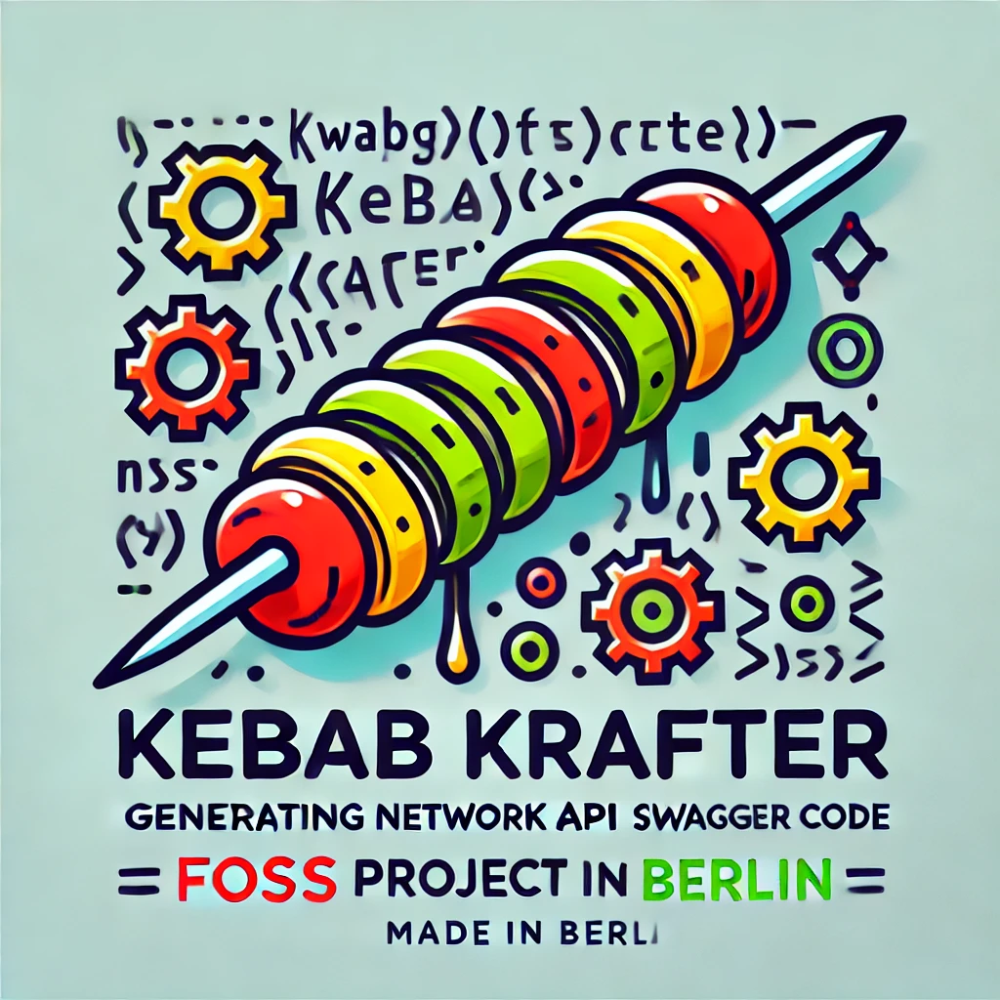

<p align="center">
  <a href="docs/kebab-krafter-v2.png" rel="noopener">
    </a>
</p>

<h2 align="center">Kebab Krafter</h2>
<h5 align="center">FOSS made with ❤️ in Berlin</h5>
<p align="center"><b>Kebab  Krafter generates all the "boring" network API code from Swagger specs in Kotlin and Swift automatically during build time.</b></p>
<p>
Kebab Krafter is available for:
    <br> - <b>Ktor Server</b>
    <br> - <b>Ktor Client</b> (coming soon)
    <br> - <b>Swift client</b> (coming soon)
</p>

---

### Table of Contents

- [About](#about)
- [Getting Started](#getting_started)
- [Documentation](docs/index.htm)
- [Usage](#usage)
- [Authors](#️authors)
- [License](#license)
- [Contribution](#contributing-to-kebab-krafter)

<br/>

## About <a name = "about"></a>

Did you ever spend plenty of time on building network interface documented in large Swagger API descriptions?

With Kebab Krafter, generating network interface in Kotlin becomes much easier and faster.

Kebab Krafter provides a gradle plugin to auto-generate network interfaces from a set of Swagger API specifications. No need for manual work anymore.

Kebab Krafter will also support Swift code development in the future, a Swift Package Manager Plugin is coming soon.


## 🏁 Getting Started <a name = "getting_started"></a>

Run Kebab Krafter gradle plugin by adding it to the gradle instructions in 
`build.gradle.kts`:

```kotlin
id("com.diconium.mobile.tools.kebab-krafter") version "version"
```

### Generate Ktor Server

Simply add the configuration to your gradle script

```kotlin

ktorServer {

	// Root package name for the generated code
	packageName = "root.package.name.for.the.generated.code"

	// File system location for the swagger spec
	specFile = File(rootDir, "swagger/api.yml")

	// Definition for the receiver class for the API controllers
	contextSpec {
		packageName = "com.myserver.api"
		className = "CallScope"
		factoryName = "from"
	}
}
```

From the example above, a `InstallRoutes.kt` is generated in the package 

`root.package.name.for.the.generated.code` 

It includes an extension function for Ktor 

`fun Route.installGeneratedRoutes(locator: ServiceLocator)`

All the necessary `data class` models and controller `interfaces` are generated automatically. This models the API in a nice and unit-testable format.

The `contextSpec` is an additional joker card to extract any kind of metadata, needed by `Ktor.ApplicationCall`, before passing them to the controller. 

In the sample application, this is demonstrated by extracting the `accept-language` header into a `Locale` object. 

To build the context as an interface is advised, so that it keeps trivial to unit-test the controller by simply creating a `FakeContext()`

The `ServiceLocator` is a very simple `get<T>` interface that can be adapted to any dependency injection you like to use. To give an example with using Koin, it would be like:

```kotlin
class KoinServiceLocator(private val koin: Koin) : ServiceLocator {
	override fun <T : Any> getService(type: KClass<T>): T = koin.get(type)
}
```

### Implement the Server

With above generated code in place, all you need to do is to implement the interfaces and install the routes on the Ktor instance.

Compare the `sample/` app's <i>"Pet Store"</i> for a full example.

## Authors <a name = "authors"></a>

- [@rvp-diconium](https://github.com/rvp-diconium)

See also the list of [contributors](https://github.com/diconium/kebab-krafter/contributors) who participated in
this project.

## License <a name="license"></a>
Kebab Krafter is licensed under [Apache License Version 2](https://github.com/diconium/kebab-krafter/LICENSE.txt). 

## Contributing to Kebab Krafter <a name="contributing"></a>

To contribute to the project, please see [Contribution documentation](https://github.com/diconium/kebab-krafter/CONTRIBUTING.md) for details.
